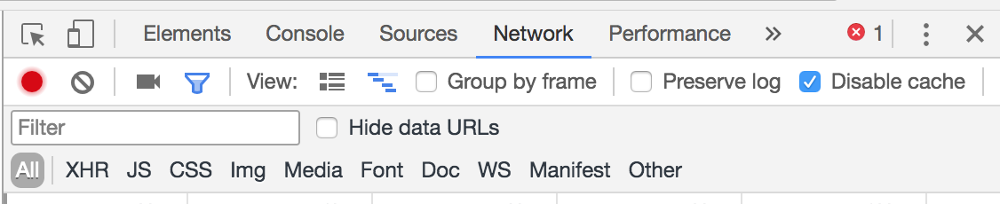

# Deadline - 4.03.18 at 23:59

### Install dependencies
```
npm i
```

### To start dev mode with live reload
```
npm start
```
then go to http://localhost:8080

### In case after reload code does not update
Check the checkbox 'Disable cache' in devtools and do not close them while developing




### Task
* add checkboxes to each task in the task list, so that when you check the checkbox - the task text becomes crossed out
* add button with 'X' at the end of each task, so that when you click this button - task is deleted
* store all tasks in localStorage, so that when you refresh the page, all tasks that were added before still there
